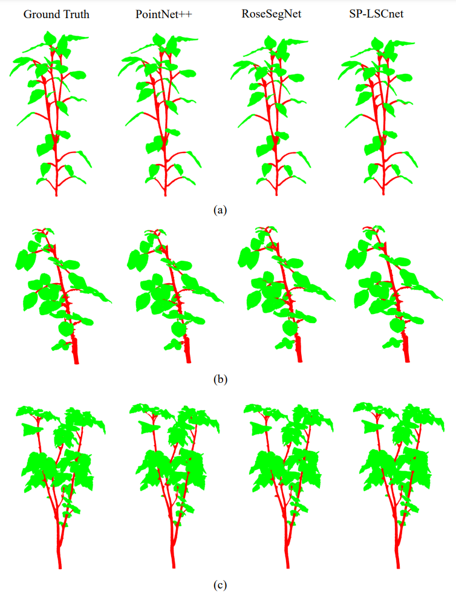

## PLANesT-3D: A new annotated dataset for segmentation of 3D plant point clouds
[](https://arxiv.org/abs/2407.21150)


## Overview: SP-LSCnet Architecture

The **SP-LSCnet** (SuperPoint-based Local Semantic Cluster Network) is a novel deep learning architecture designed for the accurate **semantic segmentation** of complex 3D plant point clouds. It addresses the critical need for automated phenotyping and robotic applications in horticulture by robustly distinguishing between fine-grained plant structures like leaves and stems.

<div align="center">
  
</div>

***Figure: Semantic segmentation results by PointNet++, RoseSegNet, and SP-LSCnet on sample pepper (a), rose (b), and ribes (c) plants. The first column corresponds to the ground truth.***


### Key Innovation

SP-LSCnet introduces a two-stage approach that enhances feature learning by intelligently structuring the input data:

1.  **Unsupervised Superpoint Extraction (MATLAB Phase):** We utilize a clustering method based on **t-distributed Stochastic Neighbor Embedding (t-SNE)** to group points into meaningful, localized **superpoints**. This step, handled by MATLAB, reduces noise and preserves local geometry.
2.  **Adaptive Feature Learning (Python/LSCnet Phase):** The subsequent 3D point-based deep learning classifier network employs **adaptive modules** to adjust the organization of these local regions for robust feature extraction and high-fidelity segmentation.
***


### Installation and Setup
This project utilizes a **hybrid environment**, relying on **MATLAB** for the initial Superpoint extraction and a **Docker container** for running the Python-based deep learning core (SP-LSCnet).

---

 1. MATLAB Requirement: Ensure you have **MATLAB** installed. This is necessary to execute the scripts that perform the extracting superpoints.

 2. Python Environment Setup 🐳: Ensure **Docker** and the **NVIDIA Container Toolkit** (if using a GPU) are installed and running on your system.

    ```bash
    #Pull the specific base image that contains
    docker pull tensorflow/tensorflow:1.4.0-devel-gpu
    
    #Run the container interactively
    docker run -it --gpus all \
        -v /path/to/your/PLANesT-3D:/app \
        -w /app \
        tensorflow/tensorflow:1.4.0-devel-gpu \
        /bin/bash
    ```
3. Thanks to the [PointNet++](https://github.com/charlesq34/pointnet2) architecture for sharing their repository publicly. The  LSCnet builds upon the original PointNet++ structure. You can follow the installation instructions from PointNet++ to set up the environment dependencies and compile the TensorFlow operator. 
    


## Usage
The **SP-LSCnet** framework utilizes the **PLANesT-3D** dataset. Follow these steps to prepare the data for training and evaluation.

### Step 1: Download and Place Raw Data

Obtain the dataset files from the official source. Place the extracted raw data directory. [**Click Here to Download PLANesT-3D**](https://www.dropbox.com/s/8gl0r0zo0j6kmdo/PLANesT-3D.rar?dl=0)

***

### Step 2: Superpoint Extraction

Before feeding the data into LSCnet, we must first extract the structural **superpoints** using unsupervised clustering (t-SNE). This is done via a MATLAB script that generates ply files.

```bash
#Execute the main training script from the MATLAB Command Window
MAIN_demo;
```
***

### Step 3: Data pre-processing

Next, the second part takes the generated superpoint, performs pre-processing and converts the data into pickle and the final **`.h5`** format. Navigate to the LSCnet directory and execute the preprocessing scripts.

```bash
cd LSCnet/script_cls
python prepare_pickle_raw.py 
python prepare_plants_h5.py 
```
***

## Step 4: Training and Evaluation

To begin the training and evaluation processes for LSCnet, executes the following scripts.

```bash
#Start training
python train.py

#Start evaluation
python evaluate_feat.py
```


## Citation
If you find our research useful, please consider citing:
```
@misc{mertoğlu2024planest3dnewannotateddataset,
      title={PLANesT-3D: A new annotated dataset for 
      segmentation of 3D plant point clouds}, 
      author={Kerem Mertoğlu and Yusuf Şalk and Server 
      Karahan Sarıkaya and Kaya Turgut and Yasemin 
      Evrenesoğlu and Hakan Çevikalp and Ömer Nezih Gerek 
      and Helin Dutağacı and David Rousseau},
      year={2024},
      eprint={2407.21150},
      archivePrefix={arXiv},
      primaryClass={cs.CV},
      url={https://arxiv.org/abs/2407.21150}, 
```
